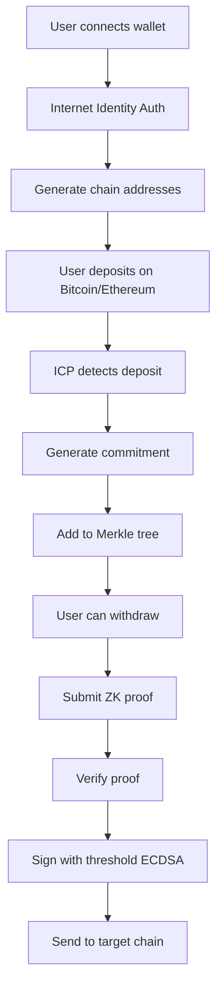

# Chain Fusion Architecture for Particle Funds

## Overview
Chain Fusion enables Particle Funds to operate as a true cross-chain privacy pool without bridges or wrapped tokens.

## How It Works

### 1. User Deposits (Multi-Chain)

```
User (Bitcoin/Ethereum) → ICP Canister → Privacy Pool
                               ↓
                       Threshold ECDSA
                     (Generate addresses)
```

**Bitcoin Flow:**
1. User gets unique Bitcoin address (derived from their principal)
2. User sends BTC to generated address
3. ICP nodes monitor Bitcoin network directly
4. Deposit detected → Generate commitment → Add to Merkle tree

**Ethereum Flow:**
1. User gets unique Ethereum address (derived from their principal)  
2. User sends ETH/tokens to generated address
3. HTTPS outcalls check balance via RPC providers
4. Deposit detected → Generate commitment → Add to Merkle tree

### 2. Privacy Pool Operations

```
Deposit Commitments → Merkle Tree → Pattern Breaking → Withdrawal Queue
         ↓                                    ↓
    Nullifiers                          Obfuscation
```

### 3. User Withdrawals (Cross-Chain)

```
ZK Proof Verification → Threshold ECDSA → Target Chain Transaction
                              ↓
                    Sign with subnet keys
```

**Key Features:**
- **No Bridges**: Direct chain integration
- **Decentralized Signing**: Threshold ECDSA with subnet consensus
- **Privacy Preserved**: ZK proofs hide link between deposits/withdrawals
- **Multi-Chain**: Deposit on one chain, withdraw on another

## Technical Components

### ChainFusionManager Canister
- Manages cross-chain operations
- Generates chain-specific addresses
- Monitors deposits
- Executes withdrawals

### Threshold ECDSA
- Subnet collectively holds private keys
- No single point of failure
- Signs transactions for Bitcoin/Ethereum

### HTTPS Outcalls
- Query Ethereum state
- Submit signed transactions
- Multiple RPC providers for reliability

## Security Model

1. **Key Security**: Private keys never exist in one place
2. **Consensus**: Transactions require subnet agreement
3. **Privacy**: Zero-knowledge proofs prevent linking
4. **Decentralization**: No trusted intermediaries

## Implementation Flow



## Advantages Over Traditional Bridges

1. **No wrapped tokens** - Real BTC/ETH
2. **No bridge hacks** - No honeypot to attack
3. **Lower fees** - No bridge operator fees
4. **Faster** - Direct chain integration
5. **More secure** - Subnet consensus required